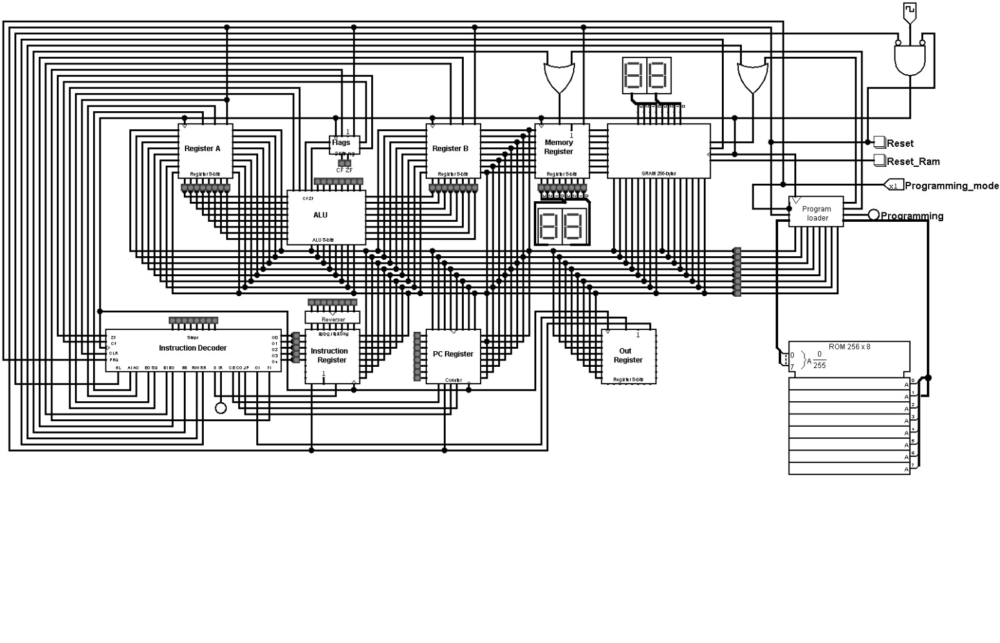
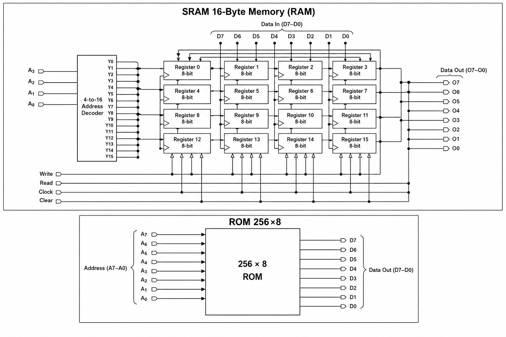
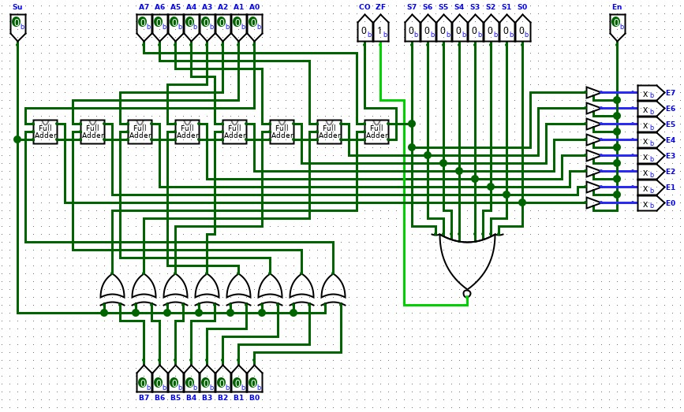
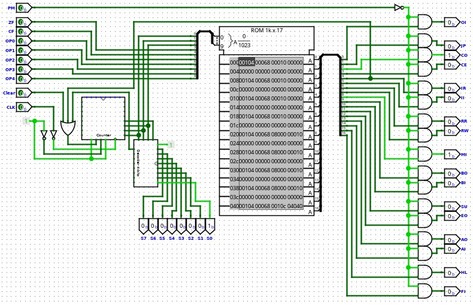
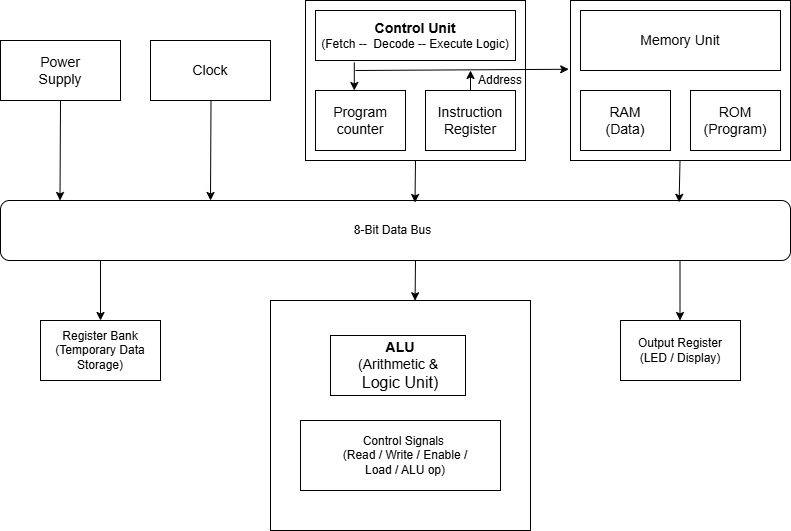
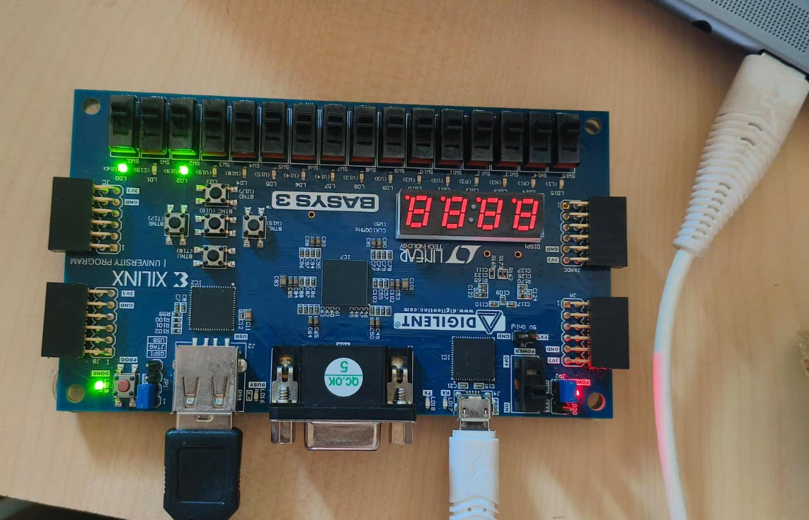

# 🚀 ANVIKSHA – 8-BIT CPU

<p align="center">
  
</p>

<p align="center">
  <b>An Educational 8-Bit CPU Designed Using Logisim Evolution and Implemented on the Basys 3 FPGA with Verilog HDL</b>
</p>

---

## 📖 Overview

**ANVIKSHA** is an educational 8-bit Central Processing Unit (CPU) developed to provide a practical understanding of computer architecture, processor organization, and digital system design. The project bridges the gap between theoretical concepts taught in computer organization courses and their real-world hardware implementation by enabling users to visualize how a processor executes instructions at the hardware level.

The processor architecture was initially designed and functionally verified using **Logisim Evolution**, allowing detailed observation of data flow and control logic through simulation. Once validated, the architecture was translated into **Verilog Hardware Description Language (HDL)** and implemented on the **Digilent Basys 3 FPGA** using the **Xilinx Vivado Design Suite**. The processor successfully demonstrates the complete **Fetch–Decode–Execute** instruction cycle, enabling execution of arithmetic, logical, memory, and control operations in both simulation and hardware environments.

Designed with a modular architecture, ANVIKSHA serves as an effective educational platform for students, educators, and enthusiasts interested in processor design, FPGA implementation, digital electronics, and embedded systems.

---

## 🎯 Project Objectives

The primary objectives of ANVIKSHA are to:

- Design and implement a fully functional educational 8-bit CPU.
- Demonstrate the internal organization and working principles of a processor.
- Bridge theoretical computer architecture concepts with practical hardware implementation.
- Understand instruction execution through the Fetch–Decode–Execute cycle.
- Develop practical experience in digital design, Verilog HDL, FPGA implementation, and processor verification.

---

## ✨ Key Features

- 🖥️ Educational 8-Bit Processor Architecture
- ⚙️ Modular CPU Design
- 🔄 Fetch–Decode–Execute Instruction Cycle
- ➕ Arithmetic and Logical Operations
- 🗂️ Register-Based Data Processing
- 💾 Memory Addressing and Instruction Decoding
- 📊 Logisim Evolution Simulation
- 🔧 Verilog HDL Implementation
- 💻 FPGA Deployment on Basys 3
- 📈 Real-Time Hardware Verification
- 🎓 Beginner-Friendly Computer Architecture Demonstration

---

## 🏗️ Processor Architecture

ANVIKSHA is composed of multiple functional modules that collectively implement the processor architecture. Each module is designed independently and later integrated to achieve complete processor functionality.

### Core Modules

- Arithmetic Logic Unit (ALU)
- Control Unit
- Register File
- Program Counter (PC)
- Instruction Decoder
- SRAM Memory
- Address Decoder
- Program Loader
- Full Adder
- Seven-Segment Display Decoder

Together, these modules perform instruction fetching, decoding, arithmetic computation, data transfer, memory access, and output visualization while maintaining synchronized processor operation.

---

## ⚙️ Technologies Used

| Technology | Purpose |
|------------|---------|
| **Logisim Evolution** | Digital Circuit Design & Functional Simulation |
| **Verilog HDL** | Hardware Description and FPGA Design |
| **Xilinx Vivado** | Synthesis, Implementation & Bitstream Generation |
| **Basys 3 FPGA (Artix-7)** | Real-Time Hardware Execution |

---

## 🔄 Instruction Execution Flow

The processor executes every instruction through the classical **Fetch–Decode–Execute** cycle.

### 📥 Fetch

- The Program Counter generates the address of the next instruction.
- The instruction is fetched from SRAM and loaded into the Instruction Register.

### 🧠 Decode

- The Instruction Decoder interprets the instruction opcode.
- The Control Unit generates the necessary control signals for execution.

### ⚡ Execute

- The Arithmetic Logic Unit performs the required arithmetic or logical operation.
- Results are stored in registers or memory and displayed through the FPGA interface when required.

---

## 📂 Repository Structure

```text
ANVIKSHA/
│
├── Logisim/                  # Logisim Evolution CPU Design
├── Verilog/                  # Verilog HDL Source Files
├── Processor/                # Top-Level CPU Module
├── ALU/                      # Arithmetic Logic Unit
├── Registers/                # Register File
├── Program Counter/          # Program Counter Module
├── SRAM/                     # Memory Module
├── Instruction Decoder/      # Instruction Decoder
├── Address Decoder/          # Address Decoder
├── Program Loader/           # Program Loader
├── Documentation/            # Project Report & Documentation
├── Report_requirements/      # Images and Figures
└── README.md
```

---

## 🖼️ Project Demonstration

### Block Diagram

<p align="center">

  
  
</p>

---

### Processor Architecture

<p align="center">

</p>

---

### FPGA Implementation

<p align="center">

</p>

## 🚀 Future Enhancements

Although ANVIKSHA successfully demonstrates the operation of an educational 8-bit processor, several enhancements can further improve its capabilities and learning value.

Future developments include:

- 16-bit Processor Architecture
- Expanded Instruction Set
- Interrupt Handling Mechanism
- Cache Memory Integration
- UART Communication Interface
- Assembly Language Support
- Enhanced Debugging and Monitoring Features
- Pipeline-Based Instruction Execution
- Improved Memory Management

---

## 👨‍💻 Development Team

This project was developed as a **Major Academic Project** by:

- **Thiyanand Murugan**
- **Chaithanya Krishnappa**
- **Fathimath Aneesha**
- **Preetha S M**
<p align="center">

</p>

## 🙏 Acknowledgements

We sincerely acknowledge the support and guidance provided by our faculty members, mentors, and the Department of Electronics & Communication Engineering throughout the development of this project.

Special thanks to:

- Logisim Evolution Development Team
- Xilinx Vivado Design Suite
- Digilent Basys 3 FPGA Platform
- Department of Electronics & Communication Engineering
- Project Guides and Faculty Mentors

---

## ⭐ If you found this project useful...

Please consider giving this repository a **⭐ Star** to support our work and encourage future educational hardware projects.
