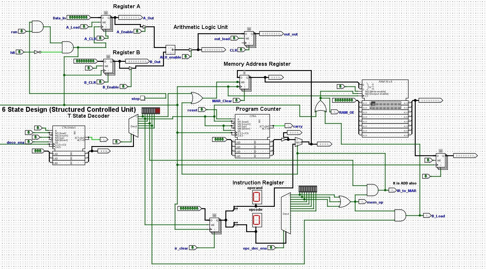
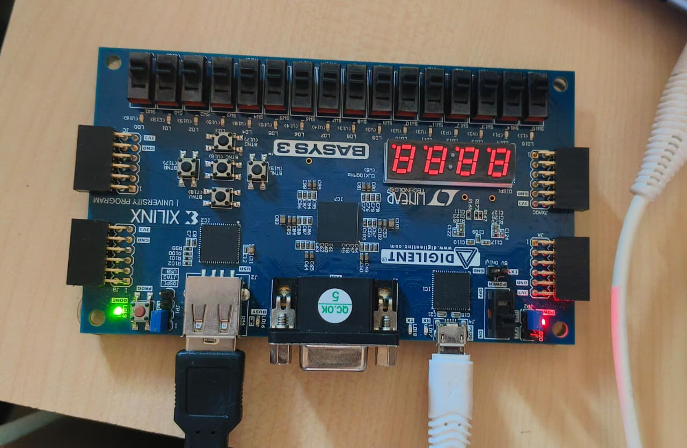
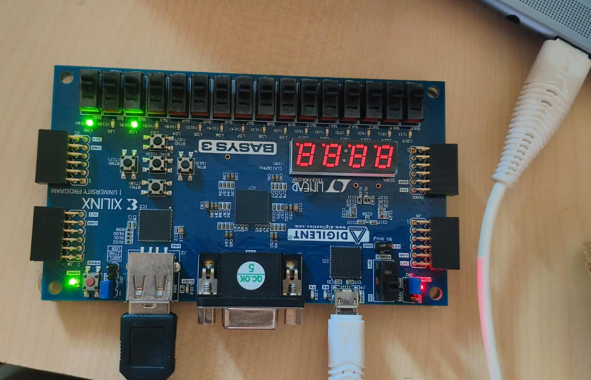

# ANVIKSHA – 8-Bit CPU

ANVIKSHA is an educational 8-bit CPU designed to demonstrate the fundamental concepts of computer architecture and processor design. The project is developed using **Logisim Evolution** for circuit design and simulation, and is being implemented on the **Basys 3 FPGA** using **Verilog HDL** for real-time hardware execution.

The project provides a practical understanding of how a processor executes instructions by integrating essential CPU components such as the Arithmetic Logic Unit (ALU), Control Unit, Registers, Program Counter, Instruction Decoder, and Memory modules. It follows the standard **Fetch–Decode–Execute** instruction cycle, enabling users to visualize and understand the internal operation of a processor.

---

## 📖 Project Overview

Modern processors are highly complex, making it difficult for beginners to understand their internal architecture. ANVIKSHA bridges this gap by implementing a simplified 8-bit CPU that demonstrates processor functionality at the hardware level.

The project is first designed and verified using Logisim Evolution, allowing easy visualization of digital circuits and data flow. The verified design is then translated into Verilog HDL and implemented on the Basys 3 FPGA to achieve real-time execution.

---

## ✨ Features

- 8-bit CPU architecture
- Modular processor design
- Fetch–Decode–Execute instruction cycle
- Arithmetic and Logical Operations
- Register-based data storage
- Memory addressing and instruction decoding
- Logisim Evolution simulation
- FPGA implementation using Basys 3
- Verilog HDL implementation
- Educational and beginner-friendly processor architecture

---

## 🏗️ Architecture

The processor consists of the following modules:

- Processor
- Arithmetic Logic Unit (ALU)
- Control Unit
- Program Counter
- Instruction Decoder
- Register File
- SRAM Memory
- Address Decoder
- Full Adder
- Program Loader
- 7-Segment Display Decoder

---

## ⚙️ Technologies Used

| Technology | Purpose |
|------------|---------|
| Logisim Evolution | CPU Design & Simulation |
| Verilog HDL | Hardware Description |
| Xilinx Vivado | FPGA Synthesis & Programming |
| Basys 3 FPGA | Hardware Implementation |

---

## 🔄 Instruction Execution Cycle

The processor executes every instruction through three stages:

### 1. Fetch
- Program Counter generates the instruction address.
- Instruction is fetched from memory.

### 2. Decode
- Instruction Decoder interprets the instruction.
- Control signals are generated.

### 3. Execute
- ALU performs arithmetic or logical operations.
- Result is stored in registers or memory.

---

## 📂 Project Structure

```
ANVIKSHA/
│
├── Processor/
├── ALU/
├── Registers/
├── Program Counter/
├── SRAM/
├── Instruction Decoder/
├── Address Decoder/
├── Program Loader/
├── Verilog/
├── Logisim/
├── Documentation/
└── README.md
```

---

## 🎯 Objectives

- Design a simple 8-bit processor from scratch.
- Understand processor architecture and instruction execution.
- Learn FPGA-based hardware implementation.
- Bridge theoretical computer architecture with practical design.
- Demonstrate real-time processor execution.

---

## 🚀 Future Enhancements

- 16-bit architecture
- Expanded instruction set
- Pipeline implementation
- Interrupt handling
- Cache memory
- UART communication
- Assembly language support
- Enhanced debugging interface

---

## 📸 Screenshots

> Add screenshots of:
- Logisim CPU Design
- ALU Circuit
- Complete Processor
- Basys 3 FPGA Implementation
- Output on FPGA

---

## 👨‍💻 Team

This project is developed as a major academic project by:

- **Thiyanand Murugan**
- **Chaithanya Krishnappa**
- **Fathimath Aneesha**
- **Preetha S M**

---
## Project Images
<p align="center">
  <b>Block Diagram </b><br><br>
  
  
</p>
<p align="center">
  <b>FPGA interface </b><br><br>
  
  
</p>


## ⭐ Acknowledgements

- Logisim Evolution
- Xilinx Vivado
- Digilent Basys 3 FPGA
- Faculty Guides and Department of Electronics & Communication Engineering
